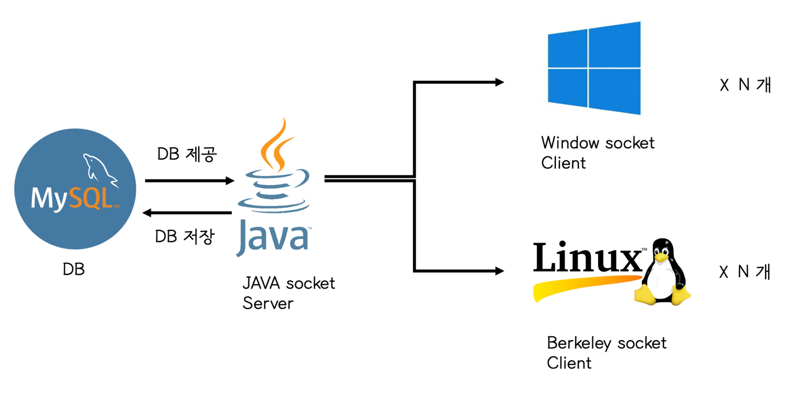
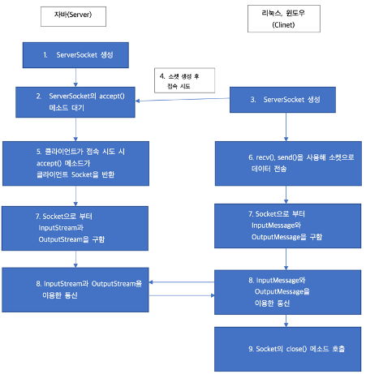
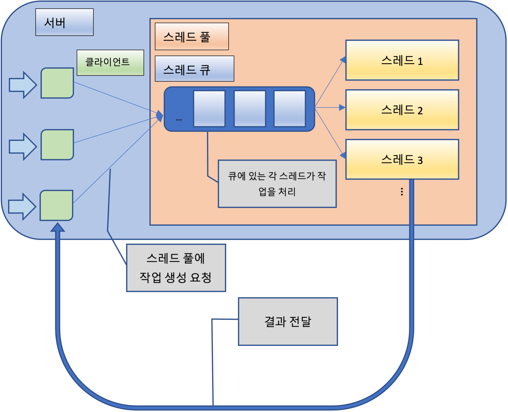
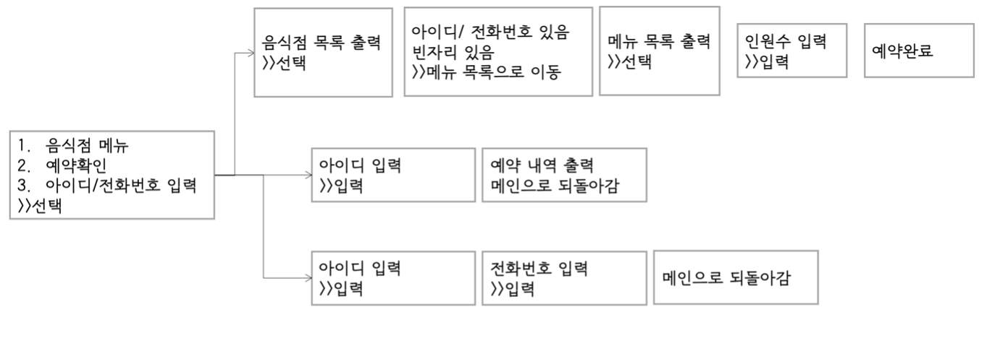
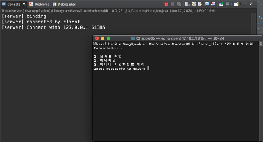
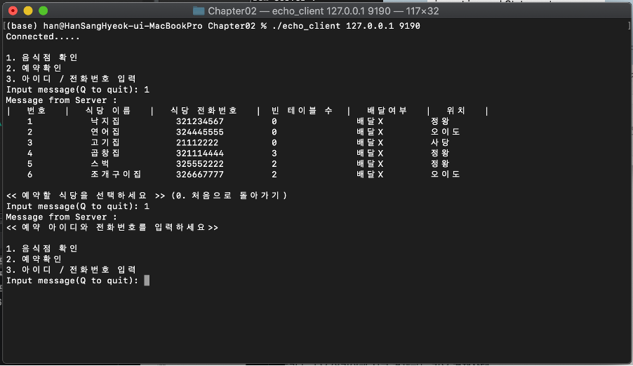
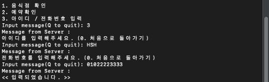
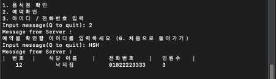
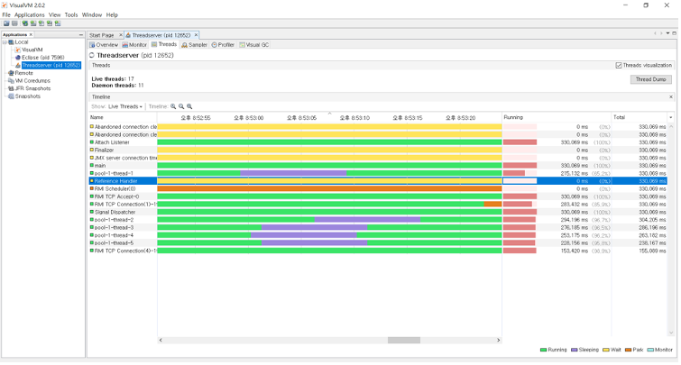
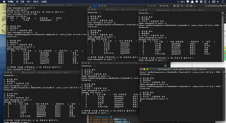

 
<h1 align="center"> 네트워크 프로그래밍 설계 과제 </h1>
<h2 align="center"> 스레드 풀을 이용한 식당 정보 확인 및 예약 소프트웨어 🏬  </h2>
 

---
## ⭐️ **팀원 역할 및 소개** ⭐️
<table>
  <tr>
    <td align="center"><a href="https://github.com/contea95"> <b>한상혁</b></a> 자바 코딩, 조건 분기 설정  리눅스 클라이언트 코딩 </td>
    <td align="center"><a href="https://github.com/Heejeong01110"> <b>강희정</b></a> 자바 코딩, 조건 분기 설정  윈도우 클라이언트 코딩 </td>
    <td align="center"><a href="https://github.com/gyujeong829"> <b>김규정</b></a> NIO, 비동기 서버 방식 코딩  PPT 제작 </td>
  </tr>
</table>

---
## **문제 정의 및 요구사항 분석**
### 문제 정의
- 코로나19로 인해 많은 장소를 돌아다니는 것은 꺼리지만, 여전히 주변 지인들과 가벼운 식사는 필요합니다. 보통 미리 전화를 통해 식당 예약을 하지만 살짝 번거롭게 느껴집니다. 그래서 배달 앱처럼 간편하게 현재 남은 좌석 확인과 예약을 진행할 수 있는 프로그램이 필요하다고 생각하여 프로그램 주제를 정하였습니다.  

### 설계 과제 목표

### 요구사항 분석
***음식점, 메뉴 관리***
-	음식점과 메뉴는 사용자가 추가, 변경, 삭제할 수 없다.
-	음식점은 위치로 검색 가능하다.
-	메뉴는 하나의 음식점에 속해야 한다.

***주문 관리***
-	주문은 하나의 음식점에 속해야 한다.
-	다른 클라이언트 계정으로 접속할 경우 사용자의 주문 정보 확인이 가능해야 한다.
-	음식점의 남은 좌석이 없을 경우 남은 좌석이 없음을 안내 후 웨이팅 예약으로 처리된다.
-	사용자가 id, 전화번호, 인원 수를 입력하지 않은 경우 예약할 수 없다.

***서버 관리***
-	자바 소켓으로 실행되며 스레드풀 방식으로 관리한다.

***클라이언트 관리***
-	Berkeley 소켓, 윈도우 소켓으로 실행되며 스레드 방식으로 관리한다.
-	클라이언트는 최대 5명까지 가능하게 한다.
-	최대 클라이언트 수를 넘을 경우 접속 불가 경고 메시지를 표시한다.

---
## **소프트웨어 설계**

### **클라이언트와 서버의 구현 방법**

---
## **데모시나리오**

### 프로그램 실행 결과

1.	자바 서버는 서버를 열고 클라이언트가 접속할 때까지 계속 확인한다.
2.	클라이언트는 접속IP와 서버 설정 PORT를 입력하고 서버에 접속한다.
3.	클라이언트는 서버에 접속 후 1번을 눌러 음식점 확인을 할 수 있지만 아이디와 전화번호를 입력하지 않았기에 예약까지 하지 못한다.

4.	아이디와 전화번호를 입력하지 않을 경우 오류메시지가 나타나면서 처음 화면으로 돌아간다.

 
<< 아이디 / 전화번호 입력 >>
 

 
5.	아이디/전화번호 입력 후 예약을 하면 예약이 됨과 동시에 DB의 예약 테이블에 해당 내용이 추가가 된다.

6.	메뉴에서 예약 확인을 입력 후 해당 아이디를 입력하면 자신의 예약 내용이 표시된다.

### 현실적 제한 요소의 반영 내용 기술

1)	4코어 노트북 / 5개 스레드 생성 시 스레드 생성 시간 변화

-	4코어 컴퓨터에서 5개 스레드를 생성하는 소프트웨어를 실행시켰더니 4개의 스레드는 빠르게 처리되었지만 하나는 다른 스레드보다 느리게 처리되었다.
-	또한 각 클라이언트는 수정 작업 시 스레드를 Sleep 하는 함수를 추가하였는데 속도 차이가 나는 것을 보아 임계 구역으로 지정한 부분을 잘 지킨 것 같다.

2)	스레드 풀을 사용한 최대 스레드 수 제한
 
-	6개의 클라이언트가 서버에 접속하였지만 오른쪽 아래의 마지막 접속 클라이언트는 스레드를 계속 기다리면서 대기하고있다.
-	다른 클라이언트가 서버에 접속 종료 시 스레드를 할당 받아 해당 데이터를 불러온다.
